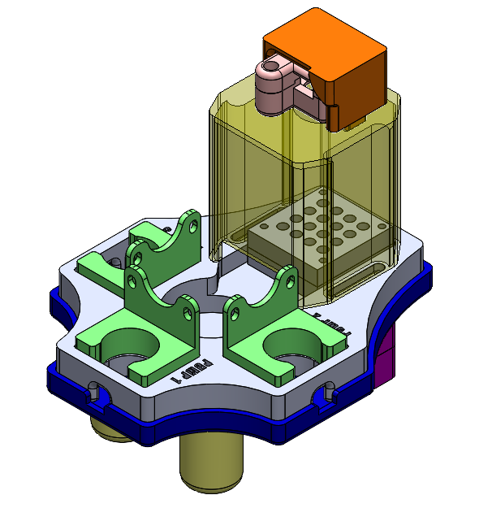

# Overview of System Hardware

## CAD Contents

1) [CAMERA_HOLDER](CAMERA_HOLDER.STL): fixes webcam on [CAMERA_MOUNT_(SIZE)](CAMERA_MOUNT_M.STL)
2) [CAMERA_MOUNT_(SIZE)](CAMERA_MOUNT_M.STL): fixes [CAMERA_HOLDER](CAMERA_HOLDER.STL) to the [INTEGRATED_UNIT](INTEGRATED_UNIT.STL), comes in four sizes (M, L, XL, XXL)
3) [INTEGRATED_UNIT](INTEGRATED_UNIT.STL): mount for [CAMERA_MOUNT_(SIZE)](CAMERA_MOUNT_M.STL), [PUMP_MOUNT(s)](PUMP_MOUNT.STL) and the uMAMA module
4) [INTEGRATED_UNIT_BASE](INTEGRATED_UNIT_BASE.STL): base for the [INTEGRATED_UNIT](INTEGRATED_UNIT.STL)
5) [LED_CASE_TOP](LED_CASE_TOP.STL), [LED_CASE_BOTTOM](LED_CASE_BOTTOM.STL): case for the LED + circuit
6) [NOTH](NOTCH.STL): used to the fix the [LED_CASE_TOP](LED_CASE_TOP.STL) to [INTEGRATED_UNIT_BASE](INTEGRATED_UNIT_BASE.STL)
7) [LEG](LEG.STL): support for [INTEGRATED_UNIT](INTEGRATED_UNIT.STL) and [INTEGRATED_UNIT_BASE](INTEGRATED_UNIT_BASE.STL)
8) [PUMP_MOUNT](PUMP_MOUNT.STL): mount for the peristaltic pumps ([product page](https://www.amazon.ca/Gikfun-Peristaltic-Connector-Aquarium-Analytic/dp/B01IUVHB8E/ref=sr_1_18?crid=37BGNL55NMAI8&keywords=peristaltic+pump&qid=1687534161&sprefix=peristaltic+pump%2Caps%2C72&sr=8-18))

## Final Assembly

